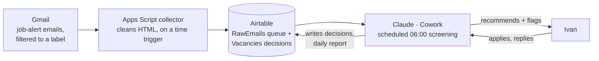

# UK DevOps — Job Search Automation

A daily, mostly hands-off pipeline that collects UK DevOps job-alert emails, screens every vacancy against personal criteria (rate, remote, IR35, clearance, tech stack), tracks applications, and produces a daily report with a side of sarcasm. The scheduled run is unattended — everything is rejected, deduplicated, or logged automatically; what's left for a human is the **recommended and flagged** roles Ivan reviews and applies to, optionally via an interactive live-link verification pass over both lists.

## How it works

Job boards and recruiters email constantly; Gmail filters label everything into one place. A small Google Apps Script picks up new emails on a frequent time trigger (cadence recorded once, in `docs/TECH_DESIGN.md` §7), cleans the links offline (decodes trackers that embed their destination in a `?url=`-style param and strips `utm_*` analytics params — no network calls, no clicking), strips the remaining HTML noise with a regex, and stores clean text in Airtable. Claude (running scheduled in Claude Cowork) reads the queue, splits digests into individual vacancies, screens them against versioned criteria, verifies ambiguous roles on the web, writes Applied/Skipped decisions to Airtable, and posts a daily report. Ivan reviews the recommended and flagged roles — optionally via an interactive Claude-in-Chrome pass that re-verifies each link on the live page first, upgrading or dropping roles — applies to the keepers, and tells Claude, which logs the outcome.

## Components

| Component | Role | In this repo |
|---|---|---|
| Gmail + filters | Intake: all job alerts under one label | — |
| Google Apps Script "UK DevOps - Gmail Collector" | Fetch, clean, store + nightly RawEmails purge; time triggers (cadence: `docs/TECH_DESIGN.md` §7) | `apps-script/` |
| Airtable base "Job Search" | State store: email queue + vacancy decisions | `airtable/` (schema-as-code) |
| Claude (Cowork) | The screening brain: split, dedupe, score, verify, report | `instructions/` (versioned rules) |
| GitHub Actions | Deploys the script (clasp) and Airtable schema on merge to main | `.github/workflows/` |
| Make.com (retired) | Original collector — decommissioned 2026-06-17; the GAS collector is now the sole pipeline | — (git history) |

## Repo map

- `apps-script/` — the collector script, manifest, setup guide
- `airtable/` — desired schema + idempotent additive apply script, plus `import-schema.js` to backfill live field ids / snapshot drift
- `instructions/` — Claude's pipeline instructions (`VERSION`-ed, source of truth); `PROJECT_FIELD_STUB.md` is the bootstrap pointer pasted into the claude.ai project field (it reads the canonical file from the mounted folder — `docs/OPERATIONS.md` → "Instructions loading")
- `docs/` — technical design & decisions (`TECH_DESIGN.md`), project brief, daily workflow, design notes, known issues, operations runbook + slice prompt template (`SLICE_PROMPT_TEMPLATE.md`)
- `tests/` — `node:test` harness + fixtures (collector: cleaning regex, offline link cleanup, parsers, reliability helpers; Airtable: schema diff/merge)
- `scripts/slice-passing-parked/` — the **parked** Cowork→Code slice-dispatch tooling (`dispatch-slice.sh` et al.); the kept flow is manual `/run-slice`. See `scripts/slice-passing-parked/README.md`
- `TODO.md` — improvement backlog + open milestone

## Status

**Intake cutover shipped (M6.2):** the screening run now reads the collector's Airtable **RawEmails** queue as its source of truth (`Status=New` → screen → flip to `Processed`), with Gmail demoted to a discrepancy canary only (an Airtable outage alerts and stops — there's no Gmail-direct screening fallback). The Make.com scenario ran in parallel as the safety net during the cutover and was decommissioned 2026-06-17; the GAS collector is now the sole pipeline.

**Screening enhancement shipped (M6.3, `VERSION: 2.1`):** an **interactive-only** Claude-in-Chrome pass now re-verifies the day's Recommend/Flag links on the live page — upgrading or dropping roles and drilling aggregator cards through to the real source posting — while the unattended scheduled run is unchanged (it writes a `<date>_recommend-flag.md` handoff file the pass consumes). Roadmap: `TODO.md`, milestone M6; runbook: `docs/OPERATIONS.md`.
